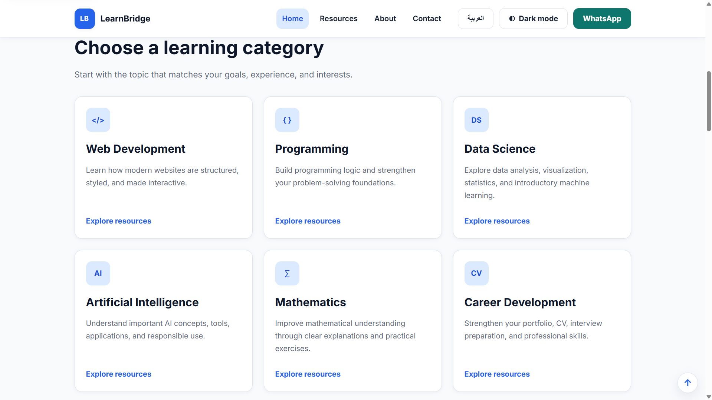
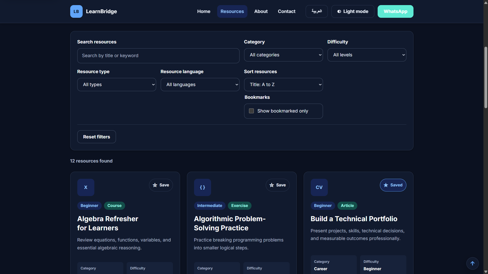
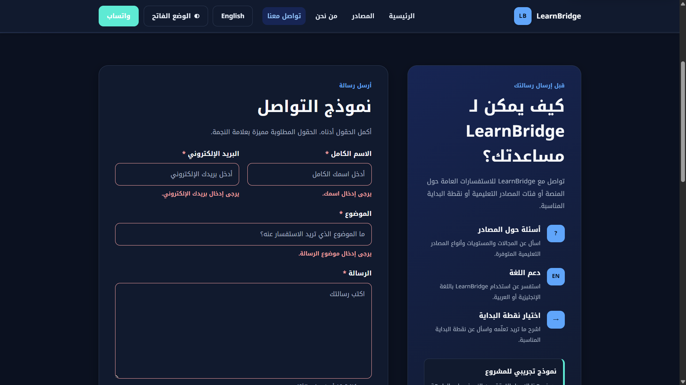
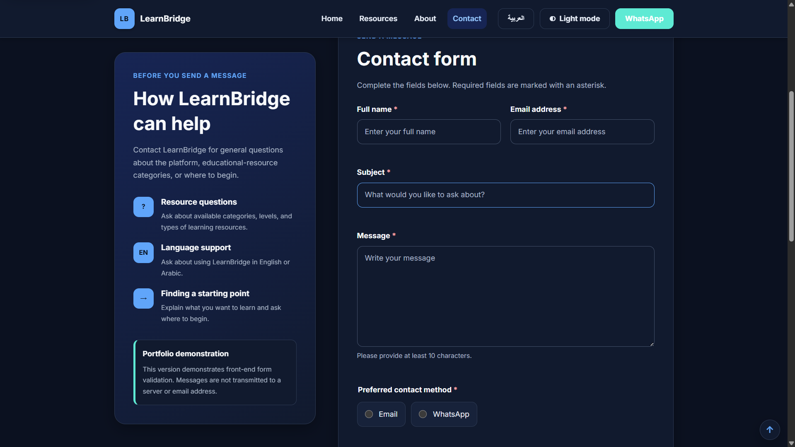

# LearnBridge

**Learn clearly. Grow confidently.**

LearnBridge is a responsive bilingual educational-resource platform built with semantic HTML, custom CSS, and vanilla JavaScript.

The platform helps learners discover, search, filter, sort, save, and explore educational resources across several learning categories while supporting both English and Arabic with complete LTR and RTL layouts.

---

## Project Overview

LearnBridge was developed as a front-end portfolio project focused on building a complete interactive website without relying on a CSS framework, JavaScript framework, or pre-built UI component library.

The project demonstrates practical front-end development skills including responsive design, bilingual interface architecture, RTL support, DOM manipulation, client-side state management, browser storage, form validation, accessibility, dark mode, and Git-based development.

---

## Screenshots

### Home Page



### Resource Library



### Arabic RTL and Dark Mode



### Contact Form



---

## Main Features

### Bilingual English and Arabic Interface

LearnBridge supports English and Arabic through a reusable JavaScript internationalization system.

The language system:

- updates visible page content
- changes form placeholders
- changes accessible labels
- updates page titles
- changes `lang` and `dir`
- switches between LTR and RTL layouts
- persists the selected language with `localStorage`
- notifies page-specific scripts when the language changes

The Arabic interface uses manually written translations rather than automatic machine translation.

### Responsive Design

The interface was designed mobile-first and adapts across phones, tablets, laptops, and desktop screens.

The main responsive ranges are:

- up to 480px
- 481px–768px
- 769px–1024px
- above 1024px

CSS Grid and Flexbox are used depending on the layout requirement, together with logical CSS properties such as `margin-inline`, `padding-inline`, and `inset-inline-end` to support both LTR and RTL layouts.

### Accessible Responsive Navigation

The navigation includes:

- mobile hamburger menu
- keyboard support
- `aria-expanded`
- `aria-controls`
- Escape-to-close behavior
- focus restoration
- desktop/mobile state handling
- progressive enhancement when JavaScript is unavailable

### Dynamic Educational Resource Library

The Resources page is generated dynamically from reusable JavaScript data rather than hard-coded card markup.

The current library includes 12 sample educational resources across:

- Web Development
- Programming
- Data Science
- Artificial Intelligence
- Mathematics
- Career Development

Users can search and filter the resource collection by:

- keyword
- category
- difficulty
- resource type
- language

Resources can also be sorted alphabetically or by estimated learning duration.

### Persistent Resource Bookmarks

Users can save resources using bookmark controls.

Only resource IDs are stored in browser `localStorage`, keeping the resource data file as the single source of truth.

Bookmarks:

- persist after page refresh
- remain available after language changes
- work with other filters
- support a bookmarked-only view
- use accessible toggle-button states

### Dark Mode

LearnBridge supports light and dark themes using CSS custom properties.

The theme system:

- detects the operating-system preference on first use
- allows manual theme switching
- stores the selected theme in `localStorage`
- persists the theme between pages
- provides translated theme controls

### Contact Form Validation

The bilingual Contact page includes custom vanilla JavaScript validation for:

- full name
- email
- subject
- message
- preferred contact method

The form provides:

- field-level validation
- bilingual error messages
- `aria-invalid` state
- focus on the first invalid field
- accessible success feedback
- validation messages that update when the interface language changes

LearnBridge v1 is a front-end-only project, so the form demonstrates validation but does not transmit messages to a server.

### Accessibility

Accessibility considerations include:

- semantic HTML
- logical heading hierarchy
- skip-to-content links
- visible keyboard focus
- keyboard-accessible navigation
- accessible mobile menu controls
- translated ARIA labels
- `aria-live` status regions
- `aria-invalid`
- `aria-describedby`
- `aria-current`
- `aria-pressed`
- approximately 44px touch targets
- reduced-motion support
- forced-colors / High Contrast support
- correct document language and direction

### Additional Shared Features

The project also includes:

- current-year footer updates
- scroll-aware Back to Top control
- demonstration newsletter validation
- reusable WhatsApp link architecture
- system-theme detection
- language-specific WhatsApp message preparation
- SEO metadata
- Open Graph metadata
- SVG favicon
- Google Fonts with fallback fonts and `display=swap`

---

## Technology Stack

LearnBridge intentionally uses a small front-end stack:

- HTML5
- CSS3
- Vanilla JavaScript
- Git
- GitHub
- GitHub Pages

No Bootstrap, Tailwind CSS, Material UI, React, Vue, Angular, jQuery, Sass, TypeScript, or backend framework is used.

The goal was to demonstrate understanding of core browser technologies before introducing framework abstractions.

---

## Project Structure

```text
learnbridge/
│
├── index.html
├── resources.html
├── about.html
├── contact.html
│
├── css/
│   ├── style.css
│   └── responsive.css
│
├── js/
│   ├── main.js
│   ├── language.js
│   ├── resources.js
│   └── contact.js
│
├── data/
│   └── resources-data.js
│
├── images/
│   ├── logo/
│   │   └── favicon.svg
│   ├── resources/
│   └── screenshots/
│       ├── home-desktop.png
│       ├── resources-desktop.png
│       ├── arabic-rtl.png
│       └── contact-form.png
│
├── .gitignore
├── LICENSE
└── README.md